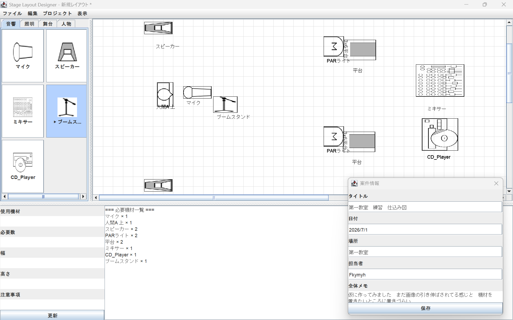

# StageLayout Designer

基本操作や会場テンプレート作成の流れは [使い方メモ.md](使い方メモ.md) にまとめています。

## 概要

StageLayout Designer は、イベントや舞台で使用する音響・照明・舞台機材などを、画面上で配置できる仕込み図作成アプリです。

Java Swing の学習を兼ねて制作しているポートフォリオで、大学時代の放送部でのイベント運営経験と、前職での照明現場の経験をもとに開発しています。

現時点では、機材の配置、移動、回転、サイズ変更、コピー＆ペースト、保存・読み込み、必要機材の自動集計など、仕込み図作成アプリとしての基本機能を中心に実装しています。

---

## 制作意図

既存の仕込み図作成ツールには、より高機能で完成度の高いものがあることは認識しています。

そのうえで、このアプリではプロの現場で使うような本格的なツールを目指すのではなく、大学サークルや学生団体、小規模なイベント運営で使いやすい簡易的な仕込み図作成ツールを目指しています。

大学サークルでは、毎年メンバーが入れ替わり、機材の扱いや図面作成に慣れていない人へ引き継ぐ必要があります。そのため、機能を増やしすぎるよりも、機材を選んで配置する、必要機材を確認する、保存して次の担当者に渡す、といった基本操作を分かりやすくすることを重視しました。

仕事の現場で使う場合には、正確性や細かい設定、多機能さが必要になりますが、学生団体では「まず簡単に使えること」「後輩に説明しやすいこと」「引き継ぎやすいこと」も重要だと考えています。

そのため、本アプリは高機能な専門ツールの代替ではなく、仕込み図作成に慣れていない人でも扱いやすい、学習・小規模運用向けの簡易版ツールとして制作しています。

---

## 制作背景

大学時代、放送部でイベント運営に関わる中で、ステージ上の機材配置、出演者の立ち位置、スピーカーや照明機材の場所などを分かりやすく共有することの大切さを感じました。

また、前職では照明現場に関わり、機材配置や事前準備の情報共有が現場の動きやすさにつながることを実感しました。

そうした経験から、専門的な図面作成ツールに慣れていない人でも、視覚的に配置を確認できるアプリがあれば便利だと考え、制作を始めました。

---

## 主な機能

)
### 機材配置

* 左側の機材パレットから機材を選択
* 音響・照明・舞台・人物などのカテゴリ別タブ表示
* 画像付きボタンによる機材選択
* キャンバス上への機材配置
* 機材画像と機材名の表示

### キャンバス操作

* ドラッグによる機材移動
* 矢印キーによる移動
* グリッド表示のON/OFF
* グリッド吸着のON/OFF
* 配置時のグリッド吸着
* スクロール可能な広いキャンバス

### 編集機能

* 機材の選択
* 右クリックメニューからの削除
* Deleteキーによる削除
* コピー＆ペースト
* 編集メニューからの削除・コピー・貼り付け
* Rキーによる回転
* 編集メニューからの回転
* + / - キーによる拡大縮小
* プロパティ欄から幅・高さを入力してサイズ変更
* 必要数の編集
* 機材ごとのメモ編集

### 必要機材の自動集計

* 配置された機材を自動で集計
* 必要機材一覧として表示
* 数量の変更を集計に反映

仕込み図を作成するだけでなく、配置した機材から必要機材を確認できる点を重視しています。

### 保存・読み込み

* 新規作成
* 保存
* 開く
* 上書き保存
* 名前を付けて保存
* 専用拡張子 `.stage` による保存
* 保存ファイル名をタイトルバーに表示
* 終了確認
* 案件情報の入力・保存・読み込み機能

現在は、機材名、位置、幅、高さ、回転、数量、メモなどを保存できる状態です。

---

## 画面イメージ

## 現在開発中の機能

案件情報として、以下の内容を扱う予定です。

* タイトル
* 日付
* 場所
* 担当者
* 全体メモ

仕込み図として実際に使いやすくするため、単なる配置図ではなく、案件ごとの情報も一緒に管理できる形を目指しています。

---

## 今後追加したい機能

### Ver.1.0までに実装したい機能

* 案件情報の `.stage` ファイルへの保存・読み込み
* 未保存変更の確認

  * 新規作成前
  * ファイルを開く前
  * 終了前
* 画像ファイル名の整理
* READMEの整備
* スクリーンショットの追加

### Ver.1.1以降で追加したい機能

* 印刷プレビュー
* PDF出力
* 帳票レイアウトでの出力
* ケーブル線や矢印の描画
* Undo / Redo
* 背景透過画像の整理
* 機材シンボルの追加
* exe化

---

## 使用技術

* Java
* Swing
* AWT
* 独自形式 `.stage` による保存・読み込み

---

## 工夫した点

* 実際のイベント現場で使う機材や情報を想定した点
* 大学サークルや学生団体でも扱いやすい操作性を意識した点
* 音響・照明・舞台・人物など、現場に近いカテゴリ分けにした点
* 画像付きの機材パレットにより、直感的に機材を選べるようにした点
* グリッド表示とグリッド吸着により、配置を整えやすくした点
* 配置した機材を自動集計し、必要機材一覧として確認できるようにした点
* 毎年メンバーが入れ替わるサークル活動でも引き継ぎやすいよう、操作を分かりやすくすることを意識した点

---

## 苦労した点・学んだこと

Java Swing を使ったGUIアプリとして、画面構成、イベント処理、機材の選択・移動・削除、保存・読み込みなどを実装しました。

特に、キャンバス上の機材操作、右クリックメニュー、キーボード操作、回転・拡大縮小、必要機材の自動集計など、ユーザー操作に応じて画面やデータを更新する処理に苦労しました。

制作を通して、クラス分割、イベント処理、リスト管理、ファイル保存、GUIアプリの状態管理について理解を深めることができました。

---

## 開発者メモ

このアプリは、既存の高機能な仕込み図作成ツールの代替を目指すものではなく、Javaの学習と、自分の経験をもとにした課題解決の練習として制作しています。

完成度や機能面ではまだ改善点がありますが、実際のイベント運営で感じた課題をもとに、使いやすさや引き継ぎやすさを意識して開発を進めています。

