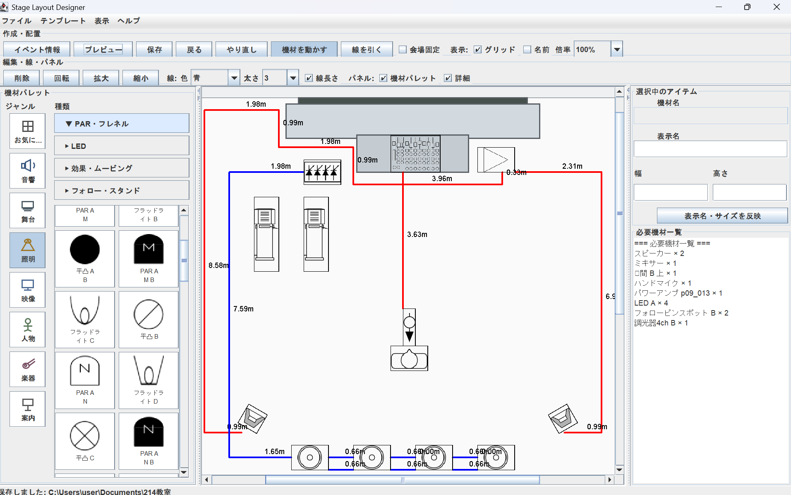
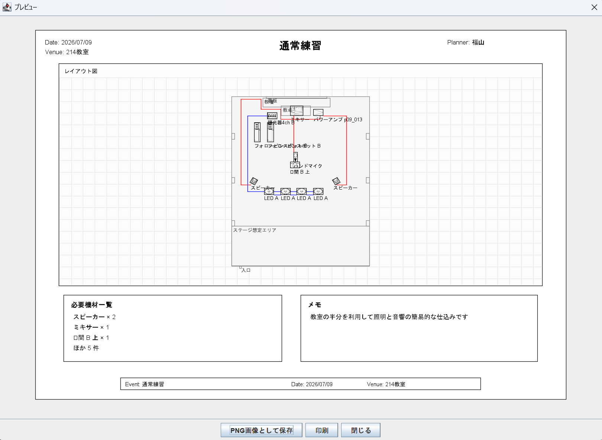

# StageLayout Designer

## v1.1.1 補足

- プレビューは、編集画面の名前表示設定に合わせて表示します。
- 画像付き機材は、プレビューで余計な黒い四角枠を出さないようにしました。
- 文字ボックスは、配置後に本文、幅、高さ、文字サイズ、背景、枠線を編集できます。
- 文字ボックスは文字モードでキャンバスをダブルクリックして作成します。選択後は右下ハンドルでもサイズ変更できます。
- 文字ボックスと背景図面は、保存、読み込み、プレビューに反映されます。
- 背景図面は PNG / JPG / JPEG / PDF に対応します。PDFは1ページ目を背景として読み込みます。
- PDF読み込みには Apache PDFBox 3.0.8 を使用しています。
- 通常の線は長さを表示できます。バミリ線はテープ位置として扱い、メートル表示は出しません。
- バミリはツールバーから選んだあと、通常の機材と同じようにキャンバスをダブルクリックして配置します。
- バミリは横、縦、X、十字、L、T、自由線を選べます。自由線だけはクリックした点をつないで描画します。
- 線を消すときは、線を選択して `Delete`、または既存の線を右クリックして削除します。
- 214教室などのテンプレートでは、細かいパーツ名が見づらい場合にプレビューで省略します。

## PDFBox について

PDF形式のフロアマップを読み込むために Apache PDFBox を使用しています。

- Library: Apache PDFBox
- Version: 3.0.8
- File: `lib/pdfbox-app-3.0.8.jar`
- Source: Apache PDFBox公式配布ページ
- License: Apache License 2.0

ライセンス文およびNOTICEは、`licenses` フォルダに収録しています。

### EclipseでのPDFBox設定

PDFBoxのjarは `lib` フォルダに配置しています。
Eclipseで認識されない場合は、jarを右クリックして
`Build Path → Add to Build Path` を選択してください。

### PDF背景図面

PNG、JPEG、PDF形式の会場図面を背景として読み込めます。
PDFは現在、先頭ページを背景図面として使用します。
読み込み時に図面の実寸幅を入力すると、グリッドや作業シートに合わせて背景図面のサイズを調整できます。

### PDF/画像から会場テンプレートを作成

ホールや施設のフロアマップPDF、または画像ファイルを読み込み、会場テンプレートとして使用できます。

読み込んだ背景図面は、`ファイル > 会場だけ保存` で会場パーツと一緒に保存できます。
保存した会場は、`ファイル > 会場テンプレートを読み込み` から呼び出せます。
また、`背景図面 > 背景図面をテンプレート登録` から、背景PDF/画像をローカルテンプレートとして登録できます。
登録した背景テンプレートは `user-templates/backgrounds` に保存され、GitHubへは追加しない設定です。

会場全体のフロアマップを使用する場合、必要に応じて事前にPDFや画像をトリミングしてから読み込むと、プレビューで見やすくなります。

### 個別ラベル表示

機材やバミリごとに、ラベルの表示/非表示を切り替えられます。
図面上で必要な説明だけを表示し、提出用プレビューを見やすくできます。

### プレビュー範囲

提出用プレビューでは、作業シート全体だけでなく、配置物や背景図面の範囲に合わせて表示できます。
会場全体図を読み込んだ場合でも、余白を抑えてレイアウト図を確認できます。

### PDF保存

提出用プレビューをPDFファイルとして保存できます。
背景図面、機材、バミリ、線、テキストボックスを含めたレイアウト図を1ページPDFとして出力できます。

StageLayout Designer は、イベントや舞台で使う音響・照明・舞台機材などを、画面上で配置して仕込み図を作るための Java Swing アプリです。

大学サークルや学生団体、小規模イベントで「後輩に説明しやすい」「迷わず配置図を作れる」ことを重視して作っています。Dynamic Draw のような高機能作図ソフトを置き換えるものではなく、仕込み図作成に必要な機能を絞った簡易ツールです。

基本操作や会場テンプレート作成の流れは [使い方メモ.md](使い方メモ.md) にまとめています。

コードの役割や引き継ぎ用の説明は [コード補足メモ.md](コード補足メモ.md) にまとめています。

## 画面イメージ





## 主な機能

### 機材配置

- 左側の機材パレットから機材を選択
- 音響、照明、舞台、人物などのカテゴリ表示
- 音響はスピーカー、マイク・スタンド、その他音響に整理
- キャンバス上への機材配置
- 機材画像と表示名の表示
- 機材やバミリごとの個別ラベル表示/非表示
- よく使う機材をアプリ全体のお気に入りとして登録

### キャンバス操作

- ドラッグによる移動
- 矢印キーによる微調整
- 回転、拡大、縮小
- コピー、貼り付け、削除
- 戻る、やり直し
- グリッド表示とグリッド吸着
- 作業シートサイズの選択
- 余白付きの全体表示

### 線・バミリ線

- 通常の線描画
- 赤いバミリ線の描画
- バミリ線はメートル表示なし
- 線のクリック選択
- 線の右クリック削除、Delete削除
- 線の始点・終点ドラッグ編集

### 背景図面の読み込み

- PNG / JPG / JPEG / PDF形式のフロアマップを背景図面として読み込み
- 読み込み時に実寸幅mを入力して背景図面サイズを調整
- 読み込んだ図面の上に機材、人物、線、テキストを配置
- 背景図面の表示/非表示、固定、削除、透明度調整に対応
- 背景図面のシート幅合わせ、シート高さ合わせ、実寸幅合わせ、中央配置に対応
- PDFは先頭ページのみを背景図面として使用

### テキストボックス

- 図面上に任意の文字を配置
- 受付、音響卓、出演者待機、立入禁止などの補足説明に利用
- 文字の移動、編集、削除に対応

### 会場テンプレート

- パレットの `舞台 > 会場パーツ` から会場図を作成
- 会場パーツと背景図面を会場テンプレートとして保存
- 保存した会場テンプレートの読み込み
- `会場固定` による会場パーツの固定
- 214教室、大学野外ステージなどの既存テンプレート

### プレビュー・提出用出力

- 提出用プレビュー表示
- PNG画像として保存
- PDFとして保存
- プレビュー印刷
- プレビュー範囲の切り替え
- イベント名と日付をもとにした保存名
- 必要機材一覧の自動集計
- メモ欄の表示

### 保存・読み込み

- 独自形式 `.stage` で保存
- イベント名、日付、会場名、担当者、メモを保存
- 機材の位置、サイズ、回転、数量、メモを保存
- 会場パーツ、線、背景図面、テキストボックスの保存
- 今のファイルを上書き保存

### アプリ内ヘルプ

- `ヘルプ > 使い方` から基本操作を確認
- 配布後もアプリ内だけで最低限の使い方を確認可能

## 配布について

JDK 21 の `jpackage` を使って、Java が入っていない Windows PC でも動く配布フォルダを作成できます。

現在は、インストーラー形式ではなく、フォルダごと配布する形式で確認しています。配布フォルダには専用の Java runtime が含まれるため、相手のPCに Java を入れてもらう必要はありません。

PDF背景図面を使える状態で配布する場合は、`lib/pdfbox-app-3.0.8.jar` を実行時のclasspathへ含めます。
また、`licenses` フォルダも配布物へ一緒に入れてください。

生成例:

```text
dist/app-image-YYYYMMDD-HHMMSS/StageLayoutDesigner/StageLayoutDesigner.exe
```

GitHub に載せる場合、配布フォルダや zip はリポジトリに直接コミットせず、GitHub Releases の添付ファイルとして置く想定です。

## 使用技術

- Java 21
- Swing
- AWT
- Apache PDFBox 3.0.8
- jpackage
- 独自形式 `.stage`

## 制作意図

既存の仕込み図作成ツールには、より高機能で完成度の高いものがあります。

このアプリでは、プロの現場で使う本格的なツールを目指すのではなく、大学サークルや学生団体で引き継ぎやすい簡易的な仕込み図作成ツールを目指しています。

大学サークルでは毎年メンバーが入れ替わるため、機材の扱いや図面作成に慣れていない人へ引き継ぐ必要があります。そのため、機能を増やしすぎるよりも、機材を選んで配置する、必要機材を確認する、保存して次の担当者に渡す、といった基本操作を分かりやすくすることを重視しています。

## 制作背景

大学時代、放送部でイベント運営に関わる中で、ステージ上の機材配置、出演者の立ち位置、スピーカーや照明機材の場所などを分かりやすく共有することの大切さを感じました。

また、前職では照明現場に関わり、機材配置や事前準備の情報共有が現場の動きやすさにつながることを実感しました。

そうした経験から、専門的な図面作成ツールに慣れていない人でも、視覚的に配置を確認できるアプリがあれば便利だと考え、制作を始めました。

## 画像素材について

このアプリでは、一部の機材シンボル画像に Dynamic Draw 関連のアプリ画像・素材を利用、または参考にしたものが含まれています。

そのため、このリポジトリは学習・ポートフォリオ目的の制作物として扱っています。画像素材の権利は各権利者に帰属します。再配布、商用利用、公開範囲の拡大を行う場合は、素材の利用条件を確認し、必要に応じて自作素材や利用許可のある素材へ差し替える必要があります。

## 背景図面として読み込むファイルについて

本アプリでは、利用者が所有または利用許可を得た画像を背景図面として読み込むことができます。
ホールや施設の公式サイトで公開されているフロアマップを利用する場合は、各施設の利用条件を確認してください。
読み込んだ図面データの権利は各権利者に帰属します。
本リポジトリでは、第三者が権利を持つフロアマップ画像やPDFを同梱しません。

## 工夫した点

- 実際のイベント現場で使う機材や情報を想定
- 初心者や後輩に引き継ぎやすい操作性
- 音響、照明、舞台、人物などの現場に近いカテゴリ分け
- 画像付きの機材パレット
- 会場テンプレートをコードではなくパレット操作で作れる方針
- 必要機材一覧の自動集計
- 提出用プレビューと印刷
- Java が入っていないPCでも動かせる配布形態

## 今後の改善候補

- WiX Toolset を使った Windows インストーラー作成
- スクリーンショットの追加
- PDF出力
- 会場パーツの編集性改善
- 素材画像の権利確認と差し替え
